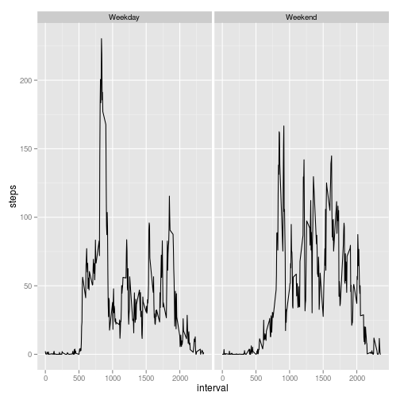

## Loading and preprocessing the data


```r
activity_data <- read.csv("activity.csv")
```


## What is mean total number of steps taken per day?


```r
total_steps_per_day <- aggregate(steps ~ date, data=activity_data, FUN=sum, na.rm=TRUE)
hist(total_steps_per_day$steps, breaks=20, main="Histogram of Total Steps per Day")
```

 

```r
mean_steps_per_day <- mean(total_steps_per_day$steps, na.rm=TRUE)
median_steps_per_day <- median(total_steps_per_day$steps, na.rm=TRUE)
```

The mean number of steps per day is 1.0766189 &times; 10<sup>4</sup>.

The median number of steps per day is 10765.

## What is the average daily activity pattern?


```r
mean_steps_per_interval <- aggregate(steps ~ interval, data=activity_data, FUN=mean, na.rm=TRUE)
plot(x=mean_steps_per_interval$interval,
     y=mean_steps_per_interval$steps,
     xlab="Interval",
     ylab="Average Steps",
     main="Average Steps per Interval",
     type="l")
```

 

```r
highest_avg_interval <- mean_steps_per_interval[mean_steps_per_interval["steps"]==max(mean_steps_per_interval$steps), "interval"]
```

The 5-minute interval with the highest average steps is the 835 minute interval.

## Imputing missing values


```r
num_rows_missing_data <- nrow(activity_data[is.na(activity_data)==TRUE, ])

imputed_activity_data <- activity_data

for(i in seq(1:nrow(imputed_activity_data))) {
    if(is.na(imputed_activity_data[i, "steps"])==TRUE) {
        imputed_activity_data[i, "steps"] <- mean_steps_per_interval[mean_steps_per_interval$interval==imputed_activity_data[i, "interval"], "steps"]
    }
}

imputed_total_steps_per_day <- aggregate(steps ~ date, data=imputed_activity_data, FUN=sum)
hist(imputed_total_steps_per_day$steps, breaks=20, main="Histogram of Total Steps per Day")
```

 

```r
imputed_mean_steps_per_day <- mean(imputed_total_steps_per_day$steps)
imputed_median_steps_per_day <- median(imputed_total_steps_per_day$steps)
```

There are 2304 rows missing data.

I imputed the missing data by filling in the average steps for that interval over other days.

Including the imputed data, the mean number of steps per day is 1.0766189 &times; 10<sup>4</sup>.

Including the imputed data, the median number of steps per day is 1.0766189 &times; 10<sup>4</sup>.

This means that there was no significant different introduced by imputing the data in this manner.

## Are there differences in activity patterns between weekdays and weekends?


```r
imputed_activity_data$date <- as.Date(imputed_activity_data$date)

imputed_activity_data$weekpart[weekdays(imputed_activity_data$date) %in% c("Saturday","Sunday")] <- "Weekend"
imputed_activity_data$weekpart[!weekdays(imputed_activity_data$date) %in% c("Saturday","Sunday")] <- "Weekday"
imputed_mean_steps_per_interval <- aggregate(steps ~ interval + weekpart, data=imputed_activity_data, FUN=mean, na.rm=TRUE)

library(ggplot2)
ggplot(imputed_mean_steps_per_interval, aes(interval, steps)) + geom_line() + facet_grid(.~weekpart)
```

 


